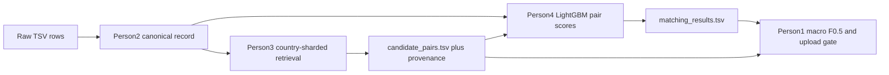

# Consolidated pipeline — Amazon ML Challenge 2026

Assembled from [docs/build_plan_person1.md](docs/build_plan_person1.md), [docs/person_2_representation_methodology.md](docs/person_2_representation_methodology.md), [docs/build_plan_person3.md](docs/build_plan_person3.md), and [.cursor/plans/person_4_matching_plan_24b6b5a3.plan.md](.cursor/plans/person_4_matching_plan_24b6b5a3.plan.md). Where those documents disagreed, this plan keeps the option that raises macro F₀.₅ under the measured data and the written rules. One rule is stated in each case.

## 1. What the submission is

For every Source 1 entity, return the set of Source 2 and Source 3 ids that are the same real-world business. The set may be empty. Source 1 is never matched to Source 1.

Scored file: `output/matching_results.tsv`, header `source1_entity_id` tab `matched_entity_ids`. Audited file: `output/candidate_pairs.tsv`, header `source1_entity_id` tab `candidate_entity_ids`. One UTF-8 row per Source 1 entity. Empty second column means no match. No duplicate ids inside a list. No `S1-` ids. Every matched id must already be in that entity's candidate list. Person 1's rule is stricter than the official validator: the validator only warns on a subset violation; the team fails the upload.

Metric, owned by Person 1 and not reimplemented by anyone else: unweighted mean of per-entity F₀.₅. Both empty → 1. Truth empty and prediction non-empty → 0. Prediction empty and truth non-empty → precision 0, recall 0, F₀.₅ 0. Otherwise precision = `|P ∩ T| / |P|`, recall = `|P ∩ T| / |T|`, and F₀.₅ = `(1.25 × P × R) / (0.25 × P + R)`. Do not use `sklearn.metrics.fbeta_score`. Predict-nothing on the full train must score exactly `123,247 / 2,206,821`.

Final zip:

```
<team_name>_submission.zip
├── output/matching_results.tsv
├── output/candidate_pairs.tsv
├── code/business_entity_resolution/src/
├── code/business_entity_resolution/README.md
├── code/business_entity_resolution/requirements.txt
└── Documentation_template.md
```

Code folders: `src/represent/`, `src/blocking/`, `src/matching/`, `src/eval/`. A thin `src/pipeline/` joins them. No registry, geocoder, search API, or external identity lookup. Model weights, if any, MIT or Apache 2.0 and at most 8B parameters. Person 4's dependencies are MIT, BSD, or Apache. No LLM in normalization. No Zingg. No libpostal.



## 2. Facts the plans already use

- Train Source 1: 2,206,821. US 1,323,633. India 883,188. France 0. Empty name, address, and country: 0. Names 100% Latin letters.
- Train Source 2: 5,034,616. Empty address 168,967. Names: 84.8% plain Latin, 5.1% Devanagari-only, 0.7% Kannada-only, 0.2% mixed, 9.1% other letters (Tamil, Telugu, Bengali, Gujarati, Malayalam, and accented Latin such as `Límited` are mixed inside that 9.1% and are not one job).
- Train Source 3: 5,285,603. Empty address 175,916.
- Gold links: 7,638,365. All same-country. Zero missing ids. Zero Source 2/3 ids linked to more than one Source 1. Source 2 links 3,693,619. Source 3 links 3,944,746. Both sources 1,776,047. Source 2 only 143,029. Source 3 only 164,498. Empty 123,247. List sizes: 1 → 119,157; 2–3 → 906,053; 4–5 → 806,072; 6–10 → 252,255; 11 or more → 37; max 11. Unmatched Source 2/3 records: 2,681,854.
- Test Source 1: 1,732,544. India 809,986 (46.8%). US 663,106 (38.3%). France 259,452 (15.0%). Test Source 2: 4,887,273, empty address 129,408. Test Source 3: 5,082,316, empty address 136,098.
- Cost of one isolated mistake (F₀.₅, then cost versus 1): miss the only true id → 0, cost 1. Add one false id on a 1-id truth while keeping the true id → 0.556, cost 0.444. On a 2-id truth, miss one → 0.833 (cost 0.167) and add one false → 0.714 (cost 0.286). On a 4-id truth, miss one → 0.938 (cost 0.062) and add one false → 0.833 (cost 0.167). Predicting nothing on a non-singleton costs 1. Share of the macro average if that bucket scores 0: singletons 5.6%, length 1 is 5.4%, 2–3 is 41.1%, 4–5 is 36.5%, 6–10 is 11.4%.
- If two Source 1 rows predict the same Source 2/3 id, only the row that does not own it takes the precision hit, unless a later uniqueness step strips the id from the true owner. That step can lower macro F₀.₅. Stolen ids and unmatched distractors are reported separately.
- Non-Latin text is real UTF-8. Open every file with `encoding="utf-8"`. Read with an explicit tab split. Commas inside addresses and id lists will collapse a row if read as CSV.
- One environment: Python 3.11 virtualenv. LightGBM and Polars are not bet on the system 3.14. Person 1's scorer is standard library only and runs in this same 3.11 env, with no pandas on that path. Polars is the attribute-table and feature tool. Pandas is Person 2's TSV reader. Cross-person handoff is Parquet plus the official TSVs, not an in-memory dataframe. Do not copy TSVs into git. Data stays outside the repo; paths live in `config.py`.

## 3. Person 1 — the only number

Artifacts in `src/eval/`. No model code and no GPU there.

Split, frozen before any model score, stratified by country × gold-list bucket `{0, 1, 2–3, 4–5, 6+}`. The 37 length-11 entities fold into `6+`. Unit is the Source 1 id. Never split links.

- `report`: 10% of each stratum, about 221,000 ids. The only number that can authorize an upload. Scored only after the operating point is locked on `loop`.
- `loop`: 5,000 ids, same strata, drawn from outside `report`. Hourly retrieval, match lists, and threshold sweeps.
- `fit`: the rest, about 1.98 million. Person 4 trains on a 400k stratified sample drawn from here. The difficulty pack is drawn here. Model fitting happens here. No threshold, cap, or set rule is chosen on `fit`.

Seed and strata in `SPLIT.md`. Ids are one per line. Do not redraw. Do not hold out all of India as a fake France. Do not replace macro with `0.550 × F_India + 0.450 × F_US`.

Beside every score, print US and India F₀.₅, singleton and non-singleton, the loss budget `sum(1 − F_i)` by error type and gold-list length, oracle F₀.₅ (`truth ∩ candidates`), candidate recall on non-empty gold lists, candidates per entity (median and share above 20, 50, 100, plus singleton width), and collision count. Micro precision, recall, and F₀.₅ are diagnostic only. France is stated as 15.0% of test Source 1 and unscored. Do not invent France labels.

The operating point is the candidate with the highest macro F₀.₅ on `loop`. Slices are printed on every run and choose the next experiment. They do not veto. There is no 0.002 rise gate and no 0.005 per-slice drop gate. A higher `loop` macro is kept even if one slice twitches. Short-name cutoff is frozen on `fit` character length and token count and written in `SPLIT.md`. Generic names use Person 2's train-only boilerplate list once it exists; until then, document frequency on `fit` text only. Slices: US, India; singleton vs non-singleton; empty address on the Source 2/3 side of a gold list; short names; generic names; gold buckets `{0, 1, 2–3, 4–5, 6+}`. After the gold-join: Indic true match versus accented-Latin-only name difference, as two slices; Source 2 only, Source 3 only, both; cross-country predictions; stolen vs unmatched distractor; predicted list longer than gold versus shorter.

Difficulty pack: about 330 Source 1 entities from `fit` only, never resampled, for reading, not for choosing a threshold. Counts of 30: easy Latin; legal-suffix/abbreviation; low-overlap true matches taken from the gold file; accented-Latin; Indic other side; empty-address matches; multi-id entities of length 4–5; unmatched-distractor near-misses; stolen-neighborhood near-misses; singletons with a lookalike; singletons with nothing nearby.

Error causes from the files: true id absent from candidates → Person 3. True id present but dropped, or false id kept → Person 4. Representation is a counterfactual on the frozen pack: compare raw token overlap with Person 2's canonical overlap. Until canonical records exist, the report says representation was not tested.

Upload gate, in order: official validator passes, including `--check-ids`; every matched id is already a candidate; macro F₀.₅ on `report`, computed after the operating point was locked on `loop`, is a number the team will stand on. Slice drops and a higher collision count are reasons to read the loss budget. They are not a rejected upload. No portal upload on day 1. Format is checked locally with `docs/validate_submission.py`; a portal slot is not a format check. First upload is day 2, after the gate, and `report` macro is logged beside the public score. Public rank is not a target. Final decision in the problem statement is the private leaderboard. Guidelines also use both leaderboards for shortlisting. At most 5 submissions a day, 25–27 September 2026 IST. Keep a spare slot each day. Keep every submitted version.

pytest locks: PDF example equals 0.714; empty/empty equals 1.0; empty truth and non-empty prediction equals 0.0; predict-nothing equals the singleton rate. Official validator stays byte-for-byte; wrap `docs/validate_submission.py`, do not fork it.

Writes §2.1 from measurements, §5 from the last `report` error report, and compiles §1 and §6 from the other three notes without inventing missing architecture text. The guidelines ask for 1–2 pages and the template says no page limit. Both stay. Do not invent a resolution. Depth lives in the template. A short overview can be the executive summary.

## 4. Person 2 — one canonical record

`src/represent/`. Python 3.11. pandas with `sep='\t'` and `quoting=csv.QUOTE_NONE`. Standard-library `re`, `unicodedata`, `string`. `collections.Counter` for token mining. pytest. Paths in `config.py`. No LLM: a local model at 100 rows/sec would take over 35 hours for 12.5 million rows; rules do 10,000–50,000 records/sec/core, are idempotent, and do not rewrite rare names into popular brands.

Pipeline, in order:

- Unicode NFKC, strip control characters `\x00-\x1f` and `\x7f-\x9f`, lowercase.
- Name: `&` and `+` → `and`; strip junk prefixes `m/s`, `messrs`, `the`, `shree`, `sri` when they are pure noise, and `http://`, `www.`; map legal suffixes to canonical forms (`pvt ltd` / `p. ltd` / `pvt. limited` → `private limited`; `ltd` → `limited`; `inc` → `incorporated`; `corp` → `corporation`; `llc` → `limited liability company`; `co` → `company`; also `gmbh`, `sarl`, `sa`, `bv`); replace other punctuation with spaces; collapse whitespace.
- Address: `None`, `NaN`, `"nan"`, `""`, and whitespace become `""` with `is_empty_address = True`, never NaN. Expand `rd`→`road`, `st`→`street`, `ave`→`avenue`, `blvd`→`boulevard`, `bldg`→`building`, `apt`/`ste`→`suite`, `flr`/`fl`→`floor`, `opp`→`opposite`, `nr`→`near`. Flag landmarks `near`, `opposite`, `behind`, `beside`, `adjacent to` as `has_landmark_ref`. Keep 6-digit Indian PIN, 5-digit US ZIP, and 5-digit French postal codes as contiguous tokens.
- Country is an open label. Unknown countries take the generic fallback. They are never dropped. France: flag `CEDEX` as `is_cedex`. India PIN `^[1-9][0-9]{5}$`. US ZIP `^[0-9]{5}$`.

Canonical contract: `entity_id`, `country`, `normalized_name`, `normalized_address`, `derived_tokens` (`name_tokens`, `address_tokens`, `is_empty_address`, `has_landmark_ref`, `postal_code`, `is_cedex`).

Two token artifacts, and only these:

- `boilerplate_tokens.json`, mined only from the three training sources. A token in more than 1.0% of training records is boilerplate. Person 1's generic-name slice uses this list. It is not an IDF.
- `idf_by_country`, one table shared by Person 3 and Person 4. Document frequency is computed inside each country label, with no labels and no external text. US and India use training rows of that country. France has no training rows, so France uses the organizer-provided test rows with `country = France` (name and address text only). An unseen token gets a smoothed background IDF, never infinity. A train-only global IDF would treat every unseen French token as maximally rare, which opens wide blocks and false merges. This is not an identity lookup.

Also `before_after_report` on the difficulty pack. Idempotency `f(f(x)) = f(x)` is a test. `postal_code` in the canonical record is the only postal field in the pipeline. Person 3 blocks on it. Person 4 does not parse a second postal regex.

Until this exists, Person 3 and Person 4 use raw fields, and Person 1's representation probe says it has not run.

## 5. Person 3 — the recall ceiling at minimum width

`src/blocking/`. The audited file is the exact last-stage set Person 4 scores, not an earlier union. Amazon reviews candidate generation, and smaller candidate sets rank better beyond the leaderboard.

Indices are built for every country string found in the current target files. An S1 row is queried only against S2/S3 rows with the same normalized country. No `if country in {"US", "India"}`. France builds and queries a France shard. Source 2 and Source 3 are queried independently, with a per-source minimum opportunity before a global cap.

Channels, each emitting provenance and a retrieval score:

- A. Exact and near-exact signatures inside country: canonical name; distinctive non-empty canonical address; `(canonical name, postal code)`; distinctive-name-token signature; raw normalized equivalents in parallel until Person 2 is trusted. Generic exact-name buckets are guarded by document frequency; a large bucket needs postal or address evidence or goes to ranked channels.
- B. Rare-token inverted retrieval, per country and source, weighted by `idf_by_country`. Rarest usable name and address tokens. Cap posting-list length. Boilerplate never opens a million-row block alone.
- C. Character n-grams on the name, initially 3–5, tested on the machine. Sparse TF-IDF/BM25, or a disk-backed n-gram accumulator, or ANN only if low-overlap gold recall does not fall. No all-pairs matrix.
- D. Address retrieval separate from name: rare address tokens, house/plot numbers with locality, postal as a partition or strong feature rather than a sole key, char n-grams or token BM25 on non-empty addresses. Empty target address goes through name-only channels and is tagged.
- E. Postal plus weak-name rescue inside equal country and postal code. Exact-name duplicates are preserved before truncation.
- F. If nothing earlier fires, a small name-first fallback inside country and source. If still nothing clears a permissive threshold, emit a legal empty list. Do not pad every row to k.

After a strong anchor, expand only through a tight duplicate signature (equal canonical name plus postal, or a high-confidence address signature). No unrestricted transitive expansion.

Selector: always keep protected high-confidence exact hits subject to generic-bucket guards; keep per-source minimum quotas when candidates exist; rank the rest with a retrieval-only score calibrated on `fit` only; choose the cap on `loop`; never touch `report` until the design is locked. Deduplicate and sort deterministically. Person 4 does not filter before scoring. `candidate_pairs.tsv` is exactly the set scored.

Country equality is enforced here and only here. No `{US, India}` whitelist. Person 4 does not apply a second country filter and does not take `country_equal` as a feature, because every candidate is already same-country. A cross-country pair in this file is a blocking bug, counted by Person 1.

After the `loop` Pareto point is frozen, run that one config, with no sweep, on Person 4's 400k `fit` sample. Those candidates are the training negatives. Then run it once on `report` after Person 4 locks the set rule. Then the full test.

Experiment ladder B0–B7 adds one channel at a time. Sweep per-source top-k in {3, 5, 10, 20} and global caps in {10, 20, 30, 50, 100}, fixed versus adaptive caps, exact-hit protection on/off, expansion on/off. Select on `loop`. Confirm once on `report` after the design is locked. Keep only Pareto points: no retained config may have both lower recall and greater-or-equal width. Initial engineering targets, not official rules: link recall ≥ 99.5%, complete-entity recall ≥ 98%, no unexplained S2/S3 or country collapse, median width ≤ 20, p95 ≤ 50, controlled p99, and a pair count Person 4 can score in the remaining time. Also report any-hit recall, oracle macro F₀.₅ by calling Person 1's scorer, S2 and S3 recall and width, recall for S2-only / S3-only / both, complete-list recall by gold bucket, mean/p90/p99/max width, share above 20/50/100, singleton mean width, empty rate, reduction ratio against the country-equality search space, wall time, peak RSS, index bytes, output bytes.

Miss TSV, same day, one row per missed true id, with Person 1's slice tags and a reason in: `NO_SHARED_EXACT_OR_TOKEN_KEY`, `FUZZY_SCORE_BELOW_THRESHOLD`, `BELOW_TOP_K`, `SOURCE_QUOTA_STARVATION`, `GLOBAL_CAP_TRUNCATION`, `MULTIMATCH_EXPANSION_MISSED`, `EMPTY_TARGET_ADDRESS_NAME_DRIFT`, `REPRESENTATION_DESTROYED_SIGNAL`, `INDEX_OR_JOIN_BUG`, `UNKNOWN`. Fix the largest bucket by lost true ids and lost complete entities.

Start on raw fields. When canonical records arrive, A/B raw only, canonical only, and the union. Accept canonical for blocking only when the frontier improves or the union repairs regressions.

Engineering: explicit tab separator, compact integer ids, persisted fingerprinted indices, chunked resumable shards, deterministic order independent of worker count, peak RSS logged. Capacity gate on a sample of at least 100k Source 1 rows before the full test run: candidate count, TSV size, retrieval time, Person 4 scoring time, index disk, peak RSS with margin, and time for validation plus one rerun. Do not launch a config that cannot finish retrieval, matching, validation, and packaging. After freeze, only a demonstrated correctness or packaging bug is accepted.

Tests include: unseen country accepted; both sources queried; empty address does not become the token `nan`; duplicates collapse; a synthetic France shard retrieves France-to-France; no cross-country pair is emitted; empty list serializes as `S1-id<TAB>\n`; `matching_results.tsv` is a row-wise subset or the checker exits non-zero and writes a proof JSON with counts and hashes.

Day 1 deliverable is candidates for all 5,000 `loop` ids plus the miss list. Day 2 freezes one recall/width point, generates the 400k `fit` candidates, then runs `report` once after the set rule is locked. Day 3 writes one row per test Source 1 id.

Writes all of template §3 and the blocking half of §2.2 from measured numbers. Does not claim France accuracy. States only that the implementation is country-open, builds France shards from test data, and contains no US/India whitelist.

## 6. Person 4 — keep, drop, or return nobody

`src/matching/`. Python 3.11 venv. Pinned polars, lightgbm, rapidfuzz, jellyfish, scikit-learn, optuna. `PYTHONUTF8=1`. `seed=42`.

Scorer: LightGBM binary, two passes. Pass 1 is pair features. Pass 2 adds context. Isotonic calibration on out-of-fold pass-2 scores. Then one-owner assignment, then set selection. Rejected inside this plan: a transformer over every pair, Splink as the main matcher (term-frequency weighting is the only idea taken from it), a graph neural net, an LLM, weights above 8B.

Training rows are Person 3's candidates for about 400k Source 1 ids, stratified by list size including singletons, drawn from `fit`. The stand-in 3-gram blocker is not used. A model trained on a different candidate distribution will be miscalibrated on the file that is scored. Each candidate is labeled 1 iff it is in gold. 5-fold `GroupKFold` by `s1_id`, inside `fit`. Out-of-fold scores feed pass 2 and calibration. No upsampling and no class reweight. Optuna (about 20 trials, 100k-entity subsample) and early stopping on log-loss also stay inside `fit`. Features built in chunks of 50k entities. Positives the blocker never returned are blocker-lost, not matcher-lost.

Name features, on Person 2's normalized name and on a legal-suffix-stripped variant: Jaro-Winkler, normalized Levenshtein, token-sort, token-set, partial ratio; char 3-gram TF-IDF cosine; token Jaccard; IDF-weighted overlap from `idf_by_country`; IDF of the rarest shared token and of the rarest unshared token on each side; exact match after suffix stripping; acronym match; digit tokens equal / conflict / absent; token counts and length ratio; script flag Latin / Devanagari / other and a same-script flag; mean IDF of the S1 name.

Address features, each with a missing indicator, never imputed: candidate address empty; house/building number equal / conflict / missing; `postal_code` from Person 2 equal / conflict / missing; `is_cedex` as a flag; token-set ratio, IDF-weighted overlap, 3-gram cosine; overlap of the last two comma-separated segments. No second postal parser.

Other: `src_is_S3`; Person 3's retrieval score and rank within source; candidate list size per source. No country one-hot and no `country_equal` feature. Pass 2 only: rank within S1 and source, gap to best, gap to next, count of candidates above 0.5, best pass-1 score this candidate gets from any other S1, and whether this S1 is its best owner. That needs `candidate_entity_id → [(source1_entity_id, p1)]` over the whole split.

LightGBM start: `num_leaves=127`, `learning_rate=0.05`, `min_data_in_leaf=200`, `feature_fraction=0.8`, `bagging_fraction=0.8`. Monotone constraints on the main similarity features. Reliability curves separately for US, India, empty-address candidates, and singletons.

Leave-one-country-out, inside `fit`: train on US and score India, then the reverse. This is the France proxy. Remove a feature whose importance collapses under that shift, or whose removal improves the held-out country score. Do not use `loop` or `report` for this.

Decision, step A, ablated on `loop`: each S2/S3 id is kept only for the S1 where its calibrated probability is highest. Keep the step only if `loop` macro F₀.₅ is higher with it on. Do not require every slice to rise. Collision count is reported and does not gate the step. The risk Person 1 named is real: if a thief outscores the true owner, the step takes the id off the owner and costs a full miss plus a false merge. The ablation is what catches that.

Decision, step B, chosen on `loop`: sort remaining candidates by calibrated `p`. Person 1's scorer is the definition, including empty-on-non-empty = 0. Under that definition the expected score of predicting the top k is

```
E[F_k] ~= 1.25 * sum(p[0:k]) / (0.25 * k + E|T|),   E|T| = sum(p) + m
E[F_0]  = prod(1 - p) * q_empty
```

`E[F_0]` is the probability the truth is empty. When the truth is non-empty, predicting empty scores 0, so those cases add nothing. `m` and `q_empty` are estimated on the `fit` candidates, bucketed by candidate count, not on `loop` or `report`. The rule family is chosen on `loop` by macro F₀.₅ only: this expected-F rule, one global threshold, or separate `t_S2` and `t_S3`. The highest `loop` macro wins.

Always: output is a subset of candidates, asserted before write; no duplicate ids; no S1 ids; one row per Source 1 entity.

Inference: chunks of 100k S1 entities; pass 1 scores written out; competition index over the whole test split; then pass 2, calibration, owner step, set rule. Person 4's volume estimate is 1.73M times width about 40, about 70M pairs. Time a 50k-entity run on day 1. If the full run would exceed 6 hours, cut feature cost. If width is too wide, the cap is applied inside Person 3's stage so the audited file still equals what is scored. Drift check before upload: France versus US and India on predicted list-size distribution, empty-rate, and calibrated-score histogram. If France's empty-rate is more than double the others, investigate before uploading.

Writes template §4, the decision half of §2.2, and false-merge / false-miss notes for Person 1 (top 50 of each, categorized).

## 7. Contracts

- Person 1 publishes `loop`, `report`, `fit`, `SPLIT.md`, the scorer command, slice tags, and the difficulty pack. If any other F₀.₅ disagrees with `src/eval/`, `src/eval/` is the number.
- Person 2 publishes the canonical schema, a version fingerprint, `boilerplate_tokens.json`, `idf_by_country`, and the before/after sheet.
- Person 3 publishes candidates for `loop`, then the 400k `fit` sample, then `report`, then test. Official TSV headers stay `source1_entity_id` and `candidate_entity_ids`. The side Parquet, which Person 4 reads, uses those same id names plus `target_source`, `retrieval_score`, `retrieval_rank_in_src`, channel bitmask, per-channel ranks and scores, exact-signature flags, rarity evidence, country, and empty-address flag. Also the candidate-report JSON, the miss TSV, and the manifest (git state, input fingerprints, normalizer version, every retrieval parameter, seed, dependency versions, hashes, wall time, peak RSS, machine summary). No absolute user paths in committed config.
- Person 4 returns `matching_results.tsv`. Person 3's subset checker and Person 1's upload gate both require it to be a subset. Person 1 returns a slice report, not a new model.
- Person 3 calls Person 1 for oracle macro F₀.₅ and does not ship a rival scorer.
- What is fit where: weights, Optuna, early stopping, leave-one-country-out, retrieval-score calibration, `m`, and `q_empty` on `fit`. Caps, quotas, the one-owner ablation, and the set-rule family on `loop`. `report` is scored once, after lock, and authorizes the upload.

## 8. Three days, from the three schedules

Day 1. Person 1: scorer and pytest locks, draw and publish the three id files, attribute table, predict-nothing scored on `report`, difficulty pack if those four are done. Person 3: country/source-sharded exact signatures and rare-token retrieval on raw fields for all 5,000 `loop` ids, then name char n-grams only for miss buckets those cannot reach. Person 4: 3.11 env, feature code, and a 50k timing on `loop` candidates. No stand-in blocker and no locked model. Person 2 starts the canonical record the same night; until it exists the others use raw fields. No portal upload.

Day 2. Person 1: gold-join of script, Indic fraction versus accented-Latin fraction, before anyone schedules transliteration; freeze the short-name cutoff on `fit`; generic names switch to Person 2's boilerplate list; unknown-country behavior check (a `France` row still yields a canonical record; empty retrieval against a train index that has no France rows is correct, not a failure); hourly error reports on `loop`. Person 2 ships canonical records, `boilerplate_tokens.json`, and `idf_by_country`. Person 3 runs raw / canonical / union, adds address, postal-local, and guarded expansion from the miss buckets, and sweeps quotas and caps on `loop`. The frozen config is then run once on the 400k `fit` sample. Person 4 trains on those candidates, runs leave-one-country-out, calibrates, ablates the one-owner step on `loop` macro, and picks the set rule on `loop` macro. Then one `report` run. Uploads only through the gate, with a spare slot left.

Day 3. Freeze code, dependencies, normalizer version, and config by midday. Person 3 writes full-test `candidate_pairs.tsv`. Person 4 writes `matching_results.tsv`. Person 1 runs the validator with `--check-ids`, applies the three upload checks, fills §5 from the last `report`, and compiles §1 and §6. Person 2 writes the representation part of §4 and the noise findings for §2.1. Person 3 writes §3 and the blocking half of §2.2. Person 4 writes §4 and the decision half of §2.2, including the France IDF and the empty-prediction definition.
