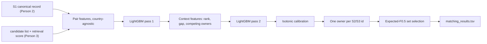

# Person 4: Match Decision Plan

## 0. Facts this plan is built on (measured on 25 Sep, not assumed)

- Test Source 1: 1,732,544 rows. US 663,106, India 809,986, **France 259,452 (about 15%)**. Test Source 2: 4,887,273 rows. Test Source 3: 5,082,316 rows. Empty addresses: 129,408 in Source 2 and 136,098 in Source 3. Source 1 has none.
- Train: 7,638,365 positive links, **0 Source 2/3 IDs linked to more than one Source 1 entity**. A target record has at most one owner. This is the strongest precision lever in the data.
- About 74% of train Source 2/3 records are linked. The rest are distractors.
- Non-Latin names are real UTF-8. About 15% of the first 500k Source 2 names are non-ASCII, and none are literal `??`. The `??` was only the Windows console failing to display them. Always open files with `encoding="utf-8"` and set `PYTHONUTF8=1`.
- Machine: 16 GB RAM, no NVIDIA GPU. System Python is 3.14. **Use a 3.11 virtual environment**, because LightGBM and Polars wheels for 3.14 are not something to bet a hackathon on.
- The official files only define the singleton cases: empty truth and empty prediction scores 1, empty truth and any ID scores 0. This plan assumes non-empty truth with an empty prediction scores 0. Confirm that against Person 1's scorer on day 1.

## 1. Architecture (final, not a menu)



Why this shape, and what I rejected:

- **Gradient boosting on similarity features, not a transformer over every pair.** The test set is about 1.73M entities times the candidate width, which is tens of millions of pairs, and you have CPU only. DeepMatcher (SIGMOD 2018) found deep models help on dirty text. Ditto (a transformer pair matcher) is the strongest published matcher, but a CPU cannot score this volume inside the window. Magellan and industry products (normalize, block, score, threshold) back this shape. LightGBM is MIT-licensed, trains in minutes, and can be re-thresholded dozens of times against the real metric. That iteration speed is worth more than one heavy model.
- **Splink / Fellegi-Sunter is not the main matcher.** You have labels, and supervised boosting uses them better. From Splink, take only its useful idea: term-frequency weighting, so a shared rare token counts more than `Inc` or `Pvt`.
- **Context and competition features (idea from HierGAT: look at neighbouring candidates, not only the pair) without a graph neural network.** Rank and score gaps give most of that benefit at almost no cost.
- **Set selection by expected F-measure, not a fixed cutoff.** This is the decision-theory result for F-measures (Jansche 2007; Ye, Chai, Lee, Chieu, "Optimizing F-measures: a tale of two approaches", ICML 2012). The empty list competes with every non-empty list on the same scale.
- **No LLM, no ship of weights above 8B, no Zingg (AGPL), no libpostal, no external lookup.** Every dependency here is MIT, BSD, or Apache.

## 2. Contracts I need from teammates (agree on day 1)

From Person 3, one Parquet file per split (train sample, validation, test) with these columns: `s1_id, cand_id, src (S2|S3), retrieval_score, retrieval_rank_in_src`. Requirements:

- Candidates must be generated for **train entities too**, not only validation and test. Otherwise the training negatives will not look like inference negatives, and the model will be miscalibrated. This is the biggest integration risk. Raise it in the first session.
- The list width must be fixed per run and reported. Recall at or above the team target, on both sources.

From Person 2: the canonical-record function, run once over all six source files, written to Parquet.

From Person 1: frozen validation S1 IDs, the scorer, and the slice tags.

Until Person 3 delivers, build a **stand-in blocker** inside `src/matching/dev/` only: character 3-gram TF-IDF on the normalized name, top 30 per source, run on a 200k-entity train subset. It exists to unblock training and is never submitted. `candidate_pairs.tsv` remains Person 3's file.

## 3. Training data

- Entities: a train S1 sample of about 400k, disjoint from Person 1's validation set, **stratified by list size including singletons**. Label each candidate 1 if it is in gold, else 0.
- Folds: 5-fold `GroupKFold` grouped by `s1_id`. Out-of-fold scores feed pass 2 and calibration. That prevents context-feature leakage.
- Do not upsample or reweight positives. The metric is decided by the set rule, not by class balance, so calibrated probabilities matter more.
- Memory: about 12M pairs times about 60 float32 features is about 3 GB. That fits in 16 GB. Build features in chunks of 50k entities and write Parquet.
- Record train-candidate recall. Positives that the blocker never returned are left out of training and counted as "blocker-lost", not "matcher-lost".

## 4. Features (all country-agnostic, all computed per pair)

Libraries: `rapidfuzz` (MIT), `polars`, `numpy`, `jellyfish` (MIT) for phonetic codes. Token IDF comes from Person 2's token resource. **IDF is computed per country label over all provided source files, including test Source 2/3 text.** That is transductive, uses no labels and no external data, and is the only way French boilerplate like `SARL`, `SAS`, `Rue`, or `Avenue` gets down-weighted without hard-coding France. Confirm that choice with the team and write it down in section 4 of the documentation.

Name features (on Person 2's normalized name, plus a legal-suffix-stripped variant):
- Jaro-Winkler, normalized Levenshtein, token-sort ratio, token-set ratio, partial ratio
- Character 3-gram TF-IDF cosine
- Token Jaccard, and IDF-weighted token overlap (shared IDF over union IDF)
- IDF of the rarest shared token, and IDF of the rarest *unshared* token on each side
- Exact match after stripping legal suffixes. Acronym match (`ABC` versus `Alpha Beta Corp`)
- Digit tokens in the name: equal, conflict, or absent
- Token counts and length ratio. Script flag on each side (Latin, Devanagari, other), plus a same-script flag
- Name "genericness": the mean IDF of the S1 name. Short or generic names are the false-merge slice.

Address features (each has a missing indicator. **Never impute an empty address.**):
- Candidate address empty (Source 2/3 only)
- House or building number: equal, conflict, or one side missing
- Longest digit run of 5 or 6 characters (postal-code-like): equal, conflict, or missing. Written as a generic digit rule, not a US ZIP or India PIN rule
- Token-set ratio, IDF-weighted token overlap, and 3-gram cosine on the address
- Overlap of the last two comma-separated segments (city/state-like, order-robust)

Record and context features:
- `country_equal` (a string comparison, which generalizes to France). **Never a one-hot encoding of country.**
- `src_is_S3`. Person 3's `retrieval_score` and `retrieval_rank_in_src`
- Candidate list size per source
- Pass 2 only (from out-of-fold pass-1 scores): rank within S1 and source, gap to the best score, gap to the next score, how many candidates score above 0.5, and **competition**: the best pass-1 score this candidate gets from any *other* S1 entity, and whether this S1 is the candidate's best owner. The competition feature needs a reverse index `cand_id -> [(s1_id, p1)]` built over the whole split.

Two checks before trusting country-equality features:
- Count cross-country gold links on train. If there are none, `country_equal = 0` is a strong negative and stays a feature. **Still never hard-filter on it.**
- Leave-one-country-out model: train on US only and score India, then the reverse. This is the proxy for France. Any feature whose importance collapses under that shift, or whose removal *improves* the cross-country score, is removed. The winning feature set is the one that holds up in the leave-one-country-out test, not only on the random split.

## 5. Model

- LightGBM, binary objective. Tune on the validation split with early stopping on log-loss, then check macro F0.5 after the set rule. Start from `num_leaves=127`, `learning_rate=0.05`, `min_data_in_leaf=200`, `feature_fraction=0.8`, `bagging_fraction=0.8`. About 20 trials of Optuna are enough, run on a 100k-entity subsample. Keep monotone constraints on the main similarity features, so a higher similarity never lowers the score. That protects against shift on France.
- Pass 1 and pass 2 use the same feature pipeline. Pass 2 adds the context features.
- **Calibration:** isotonic regression on out-of-fold pass-2 scores. Check the reliability curve separately for US, India, empty-address candidates, and singletons. The set rule depends on calibrated probabilities.

## 6. Decision layer (where the score is won)

Step A, one owner per target. After scoring every pair in the split, each S2/S3 ID is kept only for the S1 entity where its calibrated probability is highest. It is removed from every other S1 list. Justification: 0 reuses across 7.64M training links. Run it both ways (on and off) on validation. It is kept only if it improves macro F0.5 on every slice.

Step B, expected-F0.5 set selection per S1 entity. Sort the remaining candidates by calibrated `p`, highest first. For each `k` from 0 to n, estimate expected F0.5 of predicting the top `k`:

```
E[F_k] ~= 1.25 * sum(p[0:k]) / (0.25 * k + E|T|),   E|T| = sum(p) + m
E[F_0]  = prod(1 - p) * q_empty
```

- `m` is the expected number of true IDs the blocker missed for this entity. Fit it on validation as the mean missed count, bucketed by candidate count.
- `q_empty` is the probability the truth is empty, given that no candidate is true. Fit it on validation, about 1 minus the blocker-miss rate.
- Pick the `k` with the highest `E[F_k]`. This handles multi-ID lists and empty lists in one rule, with no hand-set list length.

Baseline to beat: a single global threshold `t` swept on validation. Also try per-source thresholds `t_S2`, `t_S3`, since each source can carry its own noise. Ship whichever wins macro F0.5 **and** does not lose on the singleton, list-length-1, empty-address, and generic-name slices.

Safety rules (always on):
- The output is a subset of the candidates, checked with an assertion before writing.
- No duplicate IDs, no S1 IDs, and a row for every Source 1 entity, including empty ones.

## 7. Validation and the operating point

- The only scoreboard is Person 1's frozen split plus slices.
- Report macro F0.5, precision, recall, and the oracle ceiling (score with perfect decisions on the given candidates). The gap between our score and the ceiling is the matcher's error. The ceiling's gap below 1.0 belongs to the blocker.
- **Freeze rule:** a change ships only if validation macro F0.5 rises by at least 0.002 and no named slice drops by more than 0.005.
- France has no labels, so run a drift check before every upload. Compare France with US and India on predicted list-size distribution, empty-rate, and calibrated-score histogram. If France's empty-rate is more than double the others', investigate before uploading. Likely causes are an IDF gap or a normalization gap.

## 8. Inference on test

- Stream in chunks of 100k S1 entities. Compute features, run pass 1, and write scores. Build the reverse competition index over the whole test split, then run pass 2, calibration, the owner step, and the set rule.
- Estimated volume: 1.73M times a width of about 40, which is about 70M pairs. With `rapidfuzz` `process.cpdist` and multiprocessing on all cores, expect it to take hours, not days. **Time a 50k-entity run on day 1** and cut feature cost if the full run would take more than 6 hours.
- Write `matching_results.tsv` with `sep="\t"`, UTF-8, and the exact header. Person 1 runs `docs/validate_submission.py --check-ids` before any upload.

## 9. Code layout (`src/matching/`)

- `features.py`: pair features, vectorized and chunked
- `context.py`: rank, gap, and competition features, plus the reverse index
- `train.py`: GroupKFold, pass 1 and pass 2, Optuna, saves models and the feature list
- `calibrate.py`: isotonic calibration per pass-2 output
- `decide.py`: owner constraint, expected-F0.5 set rule, threshold baseline
- `predict.py`: test inference, writes the TSV
- `dev/stand_in_blocker.py`: TF-IDF stand-in for day-1 training only
- Pin versions in `requirements.txt`. Set a fixed `seed=42` everywhere, so the run is reproducible for the audit.

## 10. Timeline and submission slots

- **Day 1 (by the evening):** Python 3.11 environment, stand-in blocker, name and address features, pass-1 LightGBM, threshold baseline, first validation macro F0.5 from Person 1. Time the 50k-entity inference. First upload only if the validator passes (it spends one slot and confirms the format).
- **Day 2:** switch to Person 3's real candidates and retrain. Pass-2 context features, calibration, owner step, expected-F0.5 rule, leave-one-country-out pruning. Two or three uploads, each tied to a validation gain.
- **Day 3:** freeze the operating point by midday. Full test run. Validator. Final upload. Write documentation section 4 and the decision half of 2.2, and hand Person 1 the false-merge and false-miss notes (top 50 of each from validation, categorized).
- Keep a spare upload slot each day for a broken-file recovery.

## 11. Risks and the answer to each

- Train candidates not generated by Person 3: use the stand-in blocker for training and retrain the moment real candidates land.
- Blocker width too wide, so inference is too slow: cap to the top K per source by `retrieval_score` **inside Person 3's step**. The file then still equals what the matcher scores.
- France degrades silently: leave-one-country-out pruning, test-set IDF, monotone constraints, and the drift check.
- Public-leaderboard overfitting: choose only on frozen validation. Public score is a sanity check, never a tuning target.
- Scorer ambiguity on an empty prediction against a non-empty truth: confirm on day 1. The set rule's `E[F_0]` formula changes if the scorer differs.
